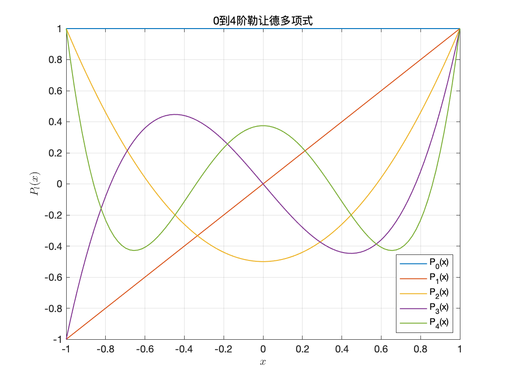
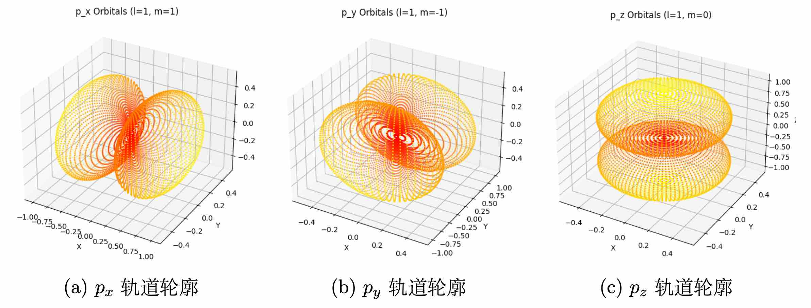

---
date:
    created: 2024-12-31
authors:
    - George
tags:
    - 课程论文
    - 量子力学
---

# 
**分离变量法解薛定谔方程的初步探索**

本文通过分离变量法对中心势场下的薛定谔方程做了简单讨论, 
用较完整的数学推导解释了为什么原子轨道角动量的取值是 $\sqrt{l(l+1)}\hbar$, 以及简要地对球函数的性质做了介绍.

<!-- more -->

## **1 $~~$薛定谔方程**

薛定谔方程是描述量子力学中微观粒子的运动的基本方程, 它的一般形式为

\begin{equation} \tag{1.1} \label{eq:Schrodinger}
    \mathrm{i} \hbar \frac{\partial \psi}{\partial t} = \left[ -\frac{\hbar^2}{2m} \nabla^2 + V(\mathbf{r}, t) \right] \psi.
\end{equation}

这是量子力学的基本假设之一, 它描述了微观粒子的波函数 $\psi$ 随时间的演化.

### 1.1 $~~$定态情形

在定态情况下, 势能 $V$ 与时间无关, 薛定谔方程可以 **{++分离变量++}** 求解, 即设

\begin{equation} \tag{1.2}
    \psi(\mathbf{r}, t) = \psi(\mathbf{r}) f(t), 
\end{equation}

代入薛定谔方程 \eqref{eq:Schrodinger}, 得到

\begin{equation} \tag{1.3}
    \frac{\mathrm{i} \hbar}{f(t)} \frac{\mathrm{d} f(t)}{\mathrm{d} t} = \frac{1}{\psi(\mathbf{r})} \left[ -\frac{\hbar^2}{2m} \nabla^2 + V(\mathbf{r}) \right] \psi(\mathbf{r}).
\end{equation}

上式左边只与时间 $t$ 有关, 右边只与空间 $\mathbf{r}$ 有关, 因此两边必须恒等于一个常数 $E$. 由此可以得到

\begin{equation} \tag{1.4} \label{eq:Schrodinger_sep}
\left\{
\begin{array} {l}
    \mathrm{i} \hbar \frac{\mathrm{d} f(t)}{\mathrm{d} t} = E f(t),  \\[2ex]
    \left[-\frac{\hbar^2}{2m} \nabla^2 + V(\mathbf{r})\right] \psi(\mathbf{r}) = E \psi(\mathbf{r}).
\end{array}
\right.
\end{equation}

式 \eqref{eq:Schrodinger_sep} 中的第一个方程可解出 $f(t) = e^{-\mathrm{i} Et/\hbar}$, 对比德布罗意关系 $E = \hbar \omega$, 可知 $E$ 就是粒子的能量.
这样定态波函数就可以写成

\begin{equation} \tag{1.5} \label{eq:wave}
    \psi(\mathbf{r}, t) = \psi(\mathbf{r}) e^{-\mathrm{i} Et/\hbar}.
\end{equation}

式 \eqref{eq:Schrodinger_sep} 的第二个方程也可以用哈密顿算符表示为

\begin{equation} \tag{1.6} \label{eq:E_eigen}
    \hat{H} \psi(\mathbf{r}) = E \psi(\mathbf{r}).
\end{equation}

该式即为能量本征方程. 这是下面讨论的基础.

### 1.2 $~~$能量本征方程

若只考虑中心势场的情况, 则势能只与粒子到原点的距离 $r$ 有关, 即 $V = V(r)$.
出于对称性的考虑, 转换到球坐标系下讨论.

球坐标系的拉普拉斯算符为

\begin{equation} \tag{1.7} \label{eq:Laplacian}
    \nabla^2 = \frac{1}{r^2} \frac{\partial}{\partial r} \left( r^2 \frac{\partial}{\partial r} \right) + \frac{1}{r^2 \sin \theta} \frac{\partial}{\partial \theta} \left( \sin \theta \frac{\partial}{\partial \theta} \right) + \frac{1}{r^2 \sin^2 \theta} \frac{\partial^2}{\partial \varphi^2}.
\end{equation}

代入薛定谔方程 \eqref{eq:Schrodinger} 中, 得到

\begin{equation} \tag{1.8} \label{eq:Schrodinger_spherical}
    -\frac{\hbar^2}{2m} \left[ \frac{1}{r^2} \frac{\partial}{\partial r} \left( r^2 \frac{\partial}{\partial r} \right) + \frac{1}{r^2 \sin \theta} \frac{\partial}{\partial \theta} \left( \sin \theta \frac{\partial}{\partial \theta} \right) + \frac{1}{r^2 \sin^2 \theta} \frac{\partial^2}{\partial \varphi^2} + V(r)\right] \psi = E \psi.
\end{equation}

这个式子形式复杂. 由于是中心势场, 不妨考虑角动量这个物理量.

## **2 $~~$角动量算符**

在量子物理学中, 一般物理量均用相应的算符表示, 算符代表对波函数的一种变换操作. 这里对角动量算符做简要的讨论.

根据经典力学定义, 角动量 $\mathbf{L} = \mathbf{r}\times\mathbf{p}$,  故角动量算符为 $\hat{\mathbf{L}}=\mathbf{r}\times\hat{\mathbf{p}}$. 具体形式即

\begin{equation} \tag{2.1}
    \hat{\mathbf{L}} = 
    \begin{vmatrix}
        \vec{i} & \vec{j} & \vec{k} \\ 
        x & y & z \\
        \hat{p}_x & \hat{p}_y & \hat{p}_z
    \end{vmatrix} = \vec{i} \left( y \hat{p}_z - z \hat{p}_y \right) + \vec{j} \left( z \hat{p}_x - x \hat{p}_z \right) + \vec{k} \left( x \hat{p}_y - y \hat{p}_x \right).
\end{equation}

借用动量的算符表达 $\hat{\mathbf{p}} = -\mathrm{i} \hbar \nabla$,  可以得到角动量算符的三个分量为

\begin{equation} \tag{2.2}
    \begin{aligned}
        \hat{L}_x &= \hat{y} \hat{p}_z - \hat{z} \hat{p}_y = -\mathrm{i} \hbar \left( y \frac{\partial}{\partial z} - z \frac{\partial}{\partial y} \right),  \\
        \hat{L}_y &= \hat{z} \hat{p}_x - \hat{x} \hat{p}_z = -\mathrm{i} \hbar \left( z \frac{\partial}{\partial x} - x \frac{\partial}{\partial z} \right),  \\
        \hat{L}_z &= \hat{x} \hat{p}_y - \hat{y} \hat{p}_x = -\mathrm{i} \hbar \left( x \frac{\partial}{\partial y} - y \frac{\partial}{\partial x} \right).
    \end{aligned}
\end{equation}

通过球坐标变换

\begin{equation} \tag{2.3}
    \left\{
    \begin{aligned}
        \frac{\partial}{\partial x} &= \sin \theta \cos \varphi \frac{\partial}{\partial r} + \frac{\cos \theta \cos \varphi}{r} \frac{\partial}{\partial \theta} - \frac{\sin \varphi}{r \sin \theta} \frac{\partial}{\partial \varphi},  \\
        \frac{\partial}{\partial y} &= \sin \theta \sin \varphi \frac{\partial}{\partial r} + \frac{\cos \theta \sin \varphi}{r} \frac{\partial}{\partial \theta} + \frac{\cos \varphi}{r \sin \theta} \frac{\partial}{\partial \varphi},  \\
        \frac{\partial}{\partial z} &= \cos \theta \frac{\partial}{\partial r} - \frac{\sin \theta}{r} \frac{\partial}{\partial \theta},
    \end{aligned}
    \right.
\end{equation}

可以得到角动量算符的分量为

\begin{equation} \tag{2.4} \label{eq:L_xyz}
    \begin{aligned}
        \hat{L}_x &= \mathrm{i} \hbar \left( \sin \varphi \frac{\partial}{\partial \theta} + \cot \theta \cos \varphi \frac{\partial}{\partial \varphi} \right),  \\
        \hat{L}_y &= -\mathrm{i} \hbar \left( \cos \varphi \frac{\partial}{\partial \theta} - \cot \theta \sin \varphi \frac{\partial}{\partial \varphi} \right),  \\
        \hat{L}_z &= -\mathrm{i} \hbar \frac{\partial}{\partial \varphi}.
    \end{aligned}
\end{equation}

进而得到角动量平方算符

\begin{equation} \tag{2.5} \label{eq:L2}
    \begin{aligned}
        \hat{L}^2 &= \hat{L}_x^2 + \hat{L}_y^2 + \hat{L}_z^2 \\
        &= -\hbar^2 \left[ \frac{1}{\sin \theta} \frac{\partial}{\partial \theta} \left( \sin \theta \frac{\partial}{\partial \theta} \right) + \frac{1}{\sin^2 \theta} \frac{\partial^2}{\partial \varphi^2} \right].
    \end{aligned}
\end{equation}

可以发现, 式 \eqref{eq:L2} 与球坐标系下拉普拉斯算符 \eqref{eq:Laplacian} 的角向分量形式相同. 两式联立得

\begin{equation} \tag{2.6}
    \nabla^2 = \frac{1}{r^2} \frac{\partial}{\partial r} \left( r^2 \frac{\partial}{\partial r} \right) - \frac{\hat{L}^2}{\hbar^2 r^2}.
\end{equation}

与式 \eqref{eq:Schrodinger_spherical} 联立, 能量本征方程化简为

\begin{equation} \tag{2.7} \label{eq:E_eigen_spherical}
    \left[ -\frac{\hbar^2}{2mr^2} \frac{\partial}{\partial r} \left( r^2 \frac{\partial}{\partial r} \right) + \frac{\hat{L}^2}{2m r^2} + V(r) \right] \psi = E \psi.
\end{equation}

大括号 $[\,]$ 中的项仅与 $r$ 有关, 可以考虑将波函数 $\psi$ 分离变量为 $R(r)Y(\theta, \varphi)$. 其中 $Y(\theta, \varphi)$ 就是球函数, 会在下一节详细展开.

## **3 $~~$球函数**

### 3.1 $~~$球函数方程

将分离变量后的波函数 $\psi$ 代入式 \eqref{eq:E_eigen_spherical}, 移项后可以得到

\begin{equation} \tag{3.1}
    \frac{1}{\hbar^2 Y} \hat{L}^2 Y = \frac{1}{R} \frac{\mathrm{d}}{\mathrm{d} r} \left( r^2 \frac{\mathrm{d} R}{\mathrm{d} r} \right) + \frac{2mr^2}{\hbar^2} \left[ E - V(r) \right].
\end{equation}

等号左边只与 $\theta, \varphi$ 有关, 右边只与 $r$ 有关, 因此两边必须恒等于一个常数 $\lambda$. 于是有
\begin{equation} \tag{3.2} \label{eq:L2_eigen}
    \hat{L}^2 Y = \lambda \hbar^2 Y.
\end{equation}

再用 \eqref{eq:L2} 代换 $\hat{L}^2$,

\begin{equation} \tag{3.3} \label{eq:spherical}
    \frac{1}{\sin \theta} \frac{\partial}{\partial \theta} \left( \sin \theta \frac{\partial Y}{\partial \theta} \right) + \frac{1}{\sin^2 \theta} \frac{\partial^2 Y}{\partial \varphi^2} + \lambda Y = 0.
\end{equation}

此即为 **{++球函数方程++}**. 通常将常数 $\lambda$ 记为 $l(l+1)$. 之后的推导会证明 $l$ 需为整数才能满足自然边界条件.

进一步分离变量, 设 $Y(\theta, \varphi) = \Theta(\theta) \Phi(\varphi)$, 代入球函数方程 \eqref{eq:spherical}, 可以得到

\begin{equation} \tag{3.4} \label{eq:theta_phi}
    \frac{\sin\theta}{\Theta} \frac{\mathrm{d}}{\mathrm{d}\theta}\left(\sin\theta\frac{\mathrm{d}\Theta}{\mathrm{d}\theta}\right) + l(l+1) \sin^2\theta = -\frac{1}{\Phi}\frac{\mathrm{d}^2\Phi}{\mathrm{d}\varphi^2} = m^2.
\end{equation}

$\Phi$ 的方程是 $\Phi'' + m^2 \Phi = 0$. 注意到 $\Phi$ 必须满足周期性边界条件, 即 $\Phi(\varphi + 2\pi) = \Phi(\varphi)$, 于是 $m$ 必须为整数. 这也是上式右边的常数写成 $m^2$ 的原因.
于是 $\Theta$ 的方程化为

\begin{equation} \tag{3.5} \label{eq:Theta}
    \sin\theta \frac{\mathrm{d}}{\mathrm{d}\theta}\left(\sin\theta\frac{\mathrm{d}\Theta}{\mathrm{d}\theta}\right) + \left[l(l+1)\sin^2\theta - m^2\right]\Theta = 0.
\end{equation}

### 3.2 $~~$勒让德方程

为了化简方程 \eqref{eq:Theta}, 引入变换 $x = \cos\theta$ ( $x$ 与直角坐标没有关系！), 变换之后 $\Theta$ 的方程化为

\begin{equation} \tag{3.6} \label{eq:Legendre_Associated}
    (1 - x^2) \frac{\mathrm{d}^2\Theta}{\mathrm{d} x^2} - 2x \frac{\mathrm{d}\Theta}{\mathrm{d} x} + \left[l(l+1) - \frac{m^2}{1 - x^2}\right]\Theta = 0.
\end{equation}

式 \eqref{eq:Legendre_Associated} 称为 **{++连带的勒让德方程++}** (Associated Legendre Equation).
特别地, 当 $m = 0$ 时, 连带的勒让德方程退化为 **{++勒让德方程++}** (Legendre Equation), 即

\begin{equation} \tag{3.7} \label{eq:Legendre}
    (1 - x^2) \frac{\mathrm{d}^2\Theta}{\mathrm{d} x^2} - 2x \frac{\mathrm{d}\Theta}{\mathrm{d} x} + l(l+1)\Theta = 0.
\end{equation}

先考虑勒让德方程的求解. 这个常微分方程还没有直接的解析解, 但是可以通过级数解法求解. 设 $y(x) = \sum_{k=0}^{\infty} a_k x^k$, 代入勒让德方程合并后得到

\begin{equation*}
    \sum_{k=0}^{\infty} \left\{(k+2)(k+1) a_{k+2} - [k(k+1) - l(l+1)]a_k\right\} x^k = 0.
\end{equation*}

故系数的递推公式为

\begin{equation} \tag{3.8} \label{eq:recurrence}
    a_{k+2} = \frac{(k-l)(k+l+1)}{(k+2)(k+1)} a_k, \quad k = 0, 1, 2, \dots
\end{equation}

为了方便递推, 将偶数次幂的解和奇数次幂的解分别记为 $y_0(x)$ 和 $y_1(x)$, 即 $y(x) = a_0 y_0(x) + a_1 y_1(x)$. 于是

\begin{equation*}
    \begin{aligned}
        y_0(x) &= 1 + \sum_{k=0}^{\infty} \frac{(2k-2-l)(2k-4-l)\cdots(2-l)(-l)\cdot(l+1)(l+3)\cdots(l+2k-1)}{(2k)!} x^{2k},  \\
        y_1(x) &= x + \sum_{k=0}^{\infty} \frac{(2k-1-l)(2k-3-l)\cdots(1-l)\cdot(l+2)(l+4)\cdots(l+2k)}{(2k+1)!} x^{2k+1}.
    \end{aligned}
\end{equation*}

接下来考察级数解的敛散性. 由式 \eqref{eq:recurrence} 可知级数的收敛半径为 1. 由于 $x = \cos \theta \in [-1, 1]$, 故只关心 $x = \pm 1$ 处的敛散性. 然而, 用高斯判别法可以证明[^1], 这两个级数解都在 $x = \pm 1$ 处发散.

[^1]: 可以参见梁昆淼《数学物理方法》中附录五的证明.

而且可以证明, 无论如何将 $y_0(x)$ 和 $y_1(x)$ 线性组合, 都无法得到同时在 $x = -1$ 和 $x = 1$ 都收敛的无穷级数解. 而很多定解问题都要求解在任意方向保持有限, 因此无穷级数必须退化为有限项（即多项式）才能满足物理要求.

观察式 \eqref{eq:recurrence}, 若 $l$ 为某个正整数, 则 $a_{l+2} = 0$, 从而 $a_{l+4}, a_{l+6}, \dots$ 都为零. 这样级数就截断成了多项式！
当 $l$ 为奇数时, $y_1(x)$ 截断为多项式, 此时 $y_0(x)$ 为无穷级数, 于是取 $a_0 = 0$ 可以得到满足物理要求的解. 当 $l$ 为偶数时, $y_0(x)$ 截断为多项式, 此时 $y_1(x)$ 为无穷级数, 就取 $a_1 = 0$.
这样就得到了勒让德方程的有限解.

通常约定解得的多项式最高次项系数为

\begin{equation*}
    a_l = \frac{(2l)!}{2^l (l!)^2}.
\end{equation*}

使用式 \eqref{eq:recurrence} 可以倒推出低阶项的系数. 最后可以求得 $l$ 阶勒让德多项式的表达式为

\begin{equation} \tag{3.9} \label{eq:Legendre_polynomial}
    P_l(x) = \sum_{k=0}^{\lfloor l/2 \rfloor} \frac{(-1)^k (2l-2k)!}{2^l k! (l-k)! (l-2k)!} x^{l-2k}.
\end{equation}

前几个勒让德多项式是

\begin{equation*}
    \begin{aligned}
        P_0(x) &= 1,  \\
        P_1(x) &= x = \cos \theta,  \\
        P_2(x) &= \frac{1}{2}(3x^2 - 1) = \frac{1}{4}(3\cos 2\theta + 1),  \\
        P_3(x) &= \frac{1}{2}(5x^3 - 3x) = \frac{1}{8}(5\cos 3\theta + 3\cos \theta),  \\
        P_4(x) &= \frac{1}{8}(35x^4 - 30x^2 + 3) = \frac{1}{64}(35\cos 4\theta + 20\cos 2\theta + 9).
    \end{aligned}
\end{equation*}

**图1：**前几个勒让德多项式的图像.

对于连带勒让德方程（$m \neq 0$）, 做变换 $\Theta(x) = (1 - x^2)^{m/2} y(x)$, 可以得到

\begin{equation} \tag{3.10} \label{eq:3.8}
    (1 - x^2)y'' - 2(m+1)x y' + \left[l(l+1) - m(m+1)\right]y = 0.
\end{equation}

对勒让德方程 \eqref{eq:Legendre} 求 $m$ 阶导数,

\begin{equation} \tag{3.11} \label{eq:3.9}
    (1-x^2)P^{(m+2)} - 2(m+1)x P^{(m+1)} + [l(l+1) - m(m+1)]P^{(m)} = 0.
\end{equation}

其中 $P^{(m)}$ 表示 $P$（在 \eqref{eq:Legendre} 中就是 $\Theta$） 的 $m$ 阶导数. 对比 \eqref{eq:3.8} \eqref{eq:3.9} 两式, 不难发现
$y(x) = P^{(m)}(x)$. 那么连带勒让德方程的解 $\Theta$ 就是

\begin{equation} \tag{3.12}
    \Theta = (1 - x^2)^{m/2} P^{(m)}(x) \equiv P_l^m(x).
\end{equation}

其中 $P_l^m(x)$ 称为连带勒让德函数. 值得指出的一点是, $P_l(x)$ 是 $l$ 阶多项式, 所以上面的求导操作最多只能求 $l$ 次, 也就是说 $m \leq l$.
而连带勒让德方程 \eqref{eq:Legendre_Associated} 中只出现了 $m^2$, 将 $m$ 替换为 $-m$ 方程保持不变, 因此 $m$ 可以也可取负整数.
事实上, $P_l^m(x)$ 和 $P_l^{-m}(x)$ 是线性相关的, 而且只差一个常数因子.
于是 $m$ 的取值为 $-l, -l+1, \dots, l-1, l$, 共 $2l+1$ 个.

$m = 0$时, 连带勒让德函数简化为勒让德多项式 $P_l(x)$. $m \neq 0$ 的前几阶连带勒让德函数是

\begin{equation*}
    \begin{aligned}
        P_1^1(x) &= (1 - x^2)^{1/2} = \sin \theta,  \\
        P_2^1(x) &= 3x(1 - x^2)^{1/2} = \frac{3}{2} \sin 2\theta,  \\
        P_2^2(x) &= 3(1 - x^2) = \frac{3}{2} (1 - \cos 2\theta).
    \end{aligned}
\end{equation*}

### 3.3 $~~$球函数的一般形式

结合上述讨论, 可以得到球函数的一般形式为

\begin{equation} \tag{3.13} \label{eq:spherical_harmonics}
    Y_l^m(\theta, \varphi) = \sqrt{\frac{2l+1}{4\pi} \frac{(l-m)!}{(l+m)!}} P_l^{|m|}(\cos\theta) e^{\mathrm{i} m \varphi}
    \left(
        \begin{aligned}
            l &= 0, 1, 2, \dots,  \\
            m &= -l, -l+1, \dots, 0, 1, \dots, l.
        \end{aligned}
    \right).
\end{equation}

这是归一化后球函数的复数形式. 球函数还有很多性质, 例如正交性、完备性等, 这里不再详细展开.
下面是一阶球函数的图像.

**图2：**一阶球函数的示意图.

## **4 $~~$总结**

经过了大量的分析计算, 我们得到了 $l$ 和 $m$ 的取值范围, 本征值的取值也呼之欲出了.
式 \eqref{eq:L2_eigen} 可改写为

\begin{equation} \tag{4.1} \label{eq:L2_eigen_final}
    \hat{L}^2 Y_l^m = l(l+1) \hbar^2 Y_l^m.
\end{equation}

此外, 利用式 \eqref{eq:L_xyz} 中 $\hat{L}_z$ 的表达式和式 \eqref{eq:theta_phi} 可以推出

\begin{equation} \tag{4.2} \label{eq:Lz_eigen}
    \hat{L}_z Y_l^m = m \hbar Y_l^m.
\end{equation}

\eqref{eq:L2_eigen_final} \eqref{eq:Lz_eigen} 两式说明, 球函数 $Y_l^m$ 是轨道角动量平方算符 $\hat{L}^2$ 和轨道角动量 $z$ 分量算符 $\hat{L}_z$ 的共同本征函数.
式 \eqref{eq:L2_eigen_final} 是 $\hat{L}^2$ 的本征方程, 本征值为 $l(l+1)\hbar^2$, 即 $L = \sqrt{l(l+1)}\hbar$；
式 \eqref{eq:Lz_eigen} 是 $\hat{L}_z$ 的本征方程, 本征值为 $L_z = m\hbar$.

实际测量时, 测量得到的值只能是本征值, 因此 $l$ 和 $m$ 的取值表现了角动量大小和方向的量子化, 而且角动量不能完全指向 $z$ 轴（即外磁场方向）.
$l$ 和 $m$ 分别称为轨道角动量量子数和磁量子数, 给定 $l$ 后, $m$ 有 $2l+1$ 个取值, 即 $2l+1$ 重简并. 这也是元素周期律的基石.

文中曾在节 [$1.1$](课程论文.md#11) 提到过定态情形下可用分离变量法求解薛定谔方程. 实际上, 分离变量法的使用场合较为局限, 很多复杂问题（空间时间耦合程度较高的问题等）无法用分离变量法求解, 目前也没有一套通用的理论判定什么方程可以用分离变量法求解.
但是对于一些简单假设下的模型, 分离变量法足够为我们提供很多有用的信息, 仍为一种重要的物理求解方法.

总结起来, 全文的讨论和计算围绕中心势场下的定态薛定谔方程展开, 通过分离变量法得到了球函数的一般形式和角动量的本征问题.
限于笔者能力, 本文对波函数的物理解释、共同本征函数与算符对易的关系等深层次问题没有过多叙述, 今后的学习中会进一步研究.

## **致谢**

感谢叶高翔老师对《原子物理》课深入浅出的讲解, 使我对原子的行为和性质有了更多更深的了解. 叶老师慷慨提供的《量子物理学》讲义节选让我初步领略到量子世界的奇妙, 也为本文提供了许多参考资料.

感谢教授《数学物理方法》这门课的鲍荣浩老师和伍斌老师. 这个 6 学分的课内容很多, 也不好理解, 但终归还是上下来了. 虽然我还有很多不甚理解之处, 但配合着《原子物理》这门课, 我还是能找到两者的勾连.
历史上, 玻恩 (Max Born) 在哥廷恩大学 (Universität Göttingen) 1923/1924 冬季学期讲授的 Atommechanik, 正是原子物理这门课.
也是在 1924 年, 哥廷根大学的两位教授理查德·库朗 (Richard Courant) 和戴维·希尔伯特 (David Hilbert) 出版了《数学物理方法》(Methoden der mathematischen Physik) 这本著作, 全面论述了当时的“数学物理方法”.
能在 100 年后的今天同时修读这两门课, 在 2024 年的最后一天完成这篇小论文, 我感到非常幸运, 希望能在物理学习的道路上继续走下去！

## **参考文献**

1. 梁昆淼. (2020). 数学物理方法 (第五版). 高等教育出版社.
2. 叶高翔. 量子物理学讲义.